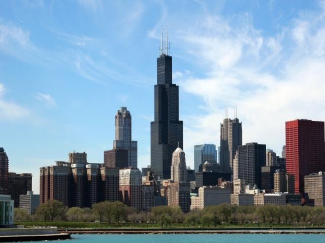
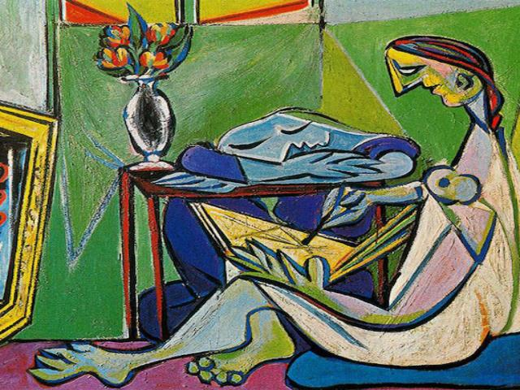
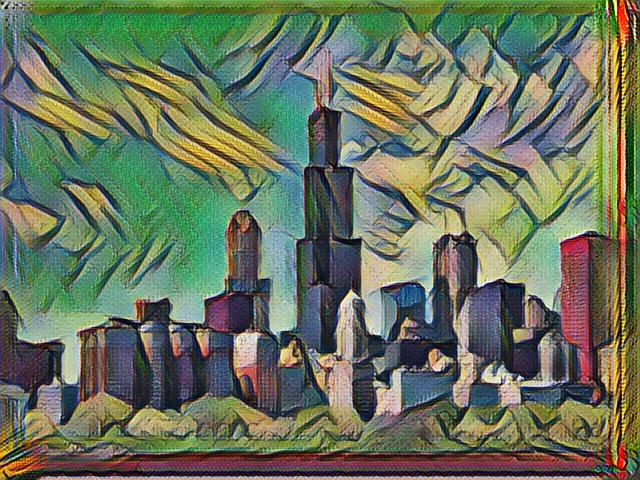
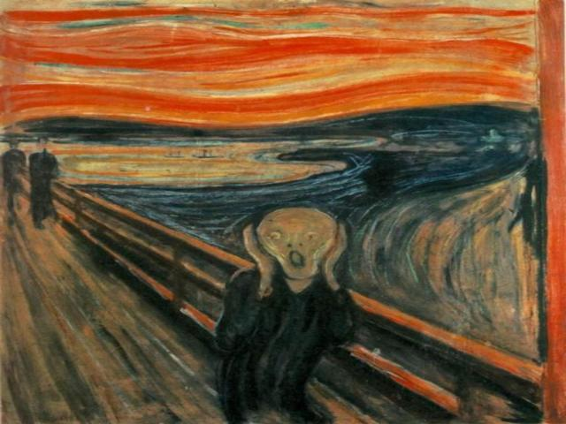
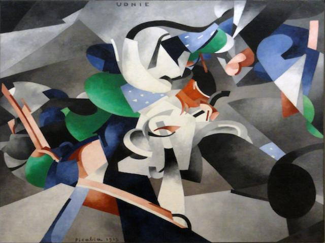
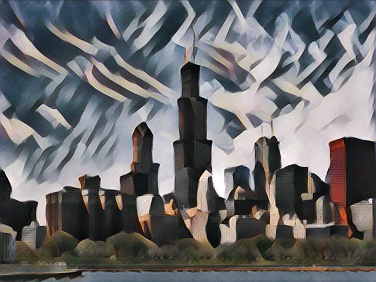

fast style transfer model
=====

This folder contains fast style transfer MACE model deployment configurations.

Introduction
---
The original pretrained model is [here](https://github.com/lengstrom/fast-style-transfer) (fast style transfer project).

## Samples:

Content image:

Styles and results:

| style | tensorflow results | mace results |
| :---: | :----: | :----: |
|  | |    |
|  | |    |
|  | |    |
|  | |    |
